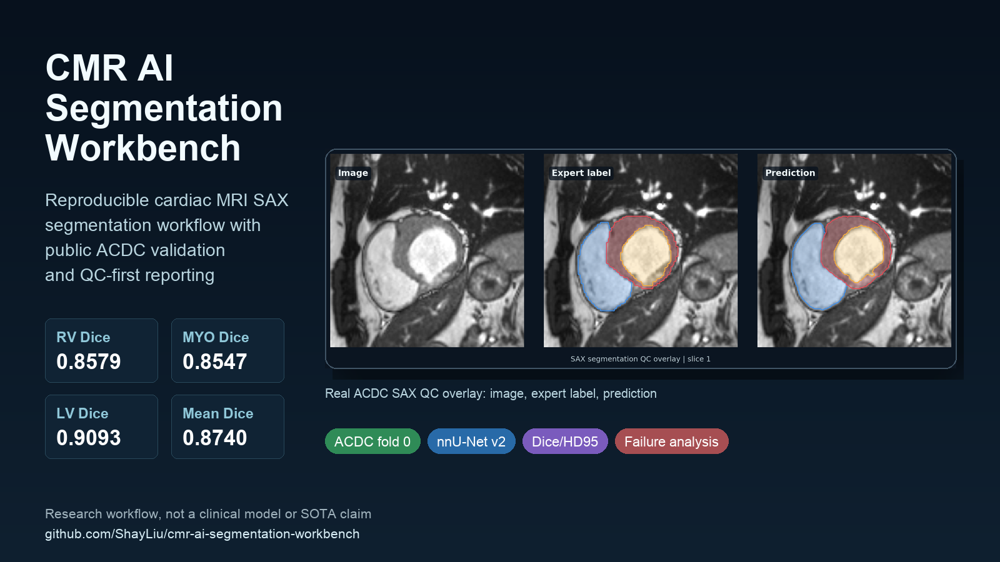

# CMR AI Segmentation Workbench

[](LICENSE)
[](requirements.txt)
[](https://github.com/MIC-DKFZ/nnUNet)
[](docs/model_and_data_statement.md)

Reproducible cardiac MRI SAX segmentation workflows with public ACDC validation, Dice/HD95 reporting, QC overlays, and failure-mode analysis.



## Current Benchmark Snapshot

Public ACDC fold 0 validation, nnU-Net v2 2D CPU debug run, conservative anatomical postprocessing.

| ACDC fold 0 | RV | Myocardium | LV |
|---|---:|---:|---:|
| Dice | 0.8579 | 0.8547 | 0.9093 |
| HD95 | 7.44 | 4.49 | 3.99 |

Mean Dice: `0.8740`; mean HD95: `5.31`.

This is a reproducibility milestone, not a clinical model or state-of-the-art claim. The next performance milestone is full GPU nnU-Net training with broader validation.

## What Is Included

| Area | Included artifacts |
|---|---|
| Data preparation | ACDC, MSD Cardiac debug, local CorSeg pseudo-label converters |
| Training workflow | nnU-Net shell wrappers and local debug trainer installer |
| Evaluation | Dice/HD95 CSV and Markdown reports |
| QC visualization | Expert-label, prediction, and failure-case overlays |
| Research hygiene | Privacy statement, release checklist, launch notes, starter issues |

The repository does not include private patient data, DICOM files, NIfTI files, trained checkpoints, or private source manifests.

## Quick Start

Install the lightweight project dependencies:

```bash
pip install -r requirements.txt
python scripts/install_tiny_debug_trainer.py
```

Prepare public ACDC data in nnU-Net format:

```bash
python scripts/prepare_acdc.py \
  --source /path/to/acdc_raw \
  --output "$nnUNet_raw/Dataset001_ACDC"
```

Train, predict, evaluate, and render QC:

```bash
DATASET_ID=1 CONFIG=2d FOLD=0 DEVICE=cuda bash scripts/train_nnunet_acdc.sh
DATASET_ID=1 CONFIG=2d FOLD=0 bash scripts/predict_nnunet_acdc.sh

python scripts/evaluate_segmentation.py \
  --pred-dir predictions/acdc_nnunet_2d_fold0 \
  --label-dir "$nnUNet_raw/Dataset001_ACDC/labelsTr" \
  --out-csv results/acdc_metrics.csv \
  --out-md results/acdc_metrics.md

python scripts/visualize_segmentation.py \
  --image "$nnUNet_raw/Dataset001_ACDC/imagesTr/patient001_frame01_0000.nii.gz" \
  --label "$nnUNet_raw/Dataset001_ACDC/labelsTr/patient001_frame01.nii.gz" \
  --prediction predictions/acdc_nnunet_2d_fold0/patient001_frame01.nii.gz \
  --output results/figures/acdc_patient001_frame01_overlay.png
```

For a fuller setup walkthrough, see [docs/quickstart.md](docs/quickstart.md).

## Results And QC

Representative validation prediction:


Representative failure case:


Key result notes:

- [ACDC nnU-Net baseline](results/acdc_nnunet_baseline.md)
- [Postprocessed fold 0 metrics](results/acdc_300epoch_fold0_val_metrics_postprocessed.md)
- [Failure analysis](results/acdc_failure_analysis.md)
- [Tiny smoke test](results/tiny_smoke_test.md)
- [MSD Cardiac debug run](results/msd_cardiac_debug.md)
- [CorSeg SAX pseudo-label debug run](results/corseg_sax_pseudolabel_debug.md)

## Project Map

```text
cmr-ai-segmentation-workbench/
├── configs/                  # local environment examples
├── docs/                     # data, privacy, launch, and troubleshooting docs
├── docs/assets/              # derived PNG/SVG figures for README and sharing
├── results/                  # metrics and result notes, no raw medical data
├── scripts/                  # data preparation, evaluation, visualization, wrappers
├── CHANGELOG.md
├── CITATION.cff
└── README.md
```

## Roadmap

| Priority | Milestone | Why it matters |
|---|---|---|
| 1 | Full GPU nnU-Net 2D ACDC baseline | Establish a fairer public benchmark |
| 2 | MONAI ACDC baseline | Add an independent implementation path |
| 3 | ED vs ES stratified reporting | Clarify small-cavity and phase-specific failure modes |
| 4 | 3D full-resolution baseline | Test spatial context for basal/apical errors |
| 5 | Paper-ready technical report | Convert workflow evidence into a citable research artifact |

Open tracking issue: [Add minimal MONAI baseline](https://github.com/ShayLiu/cmr-ai-segmentation-workbench/issues/3). Community feedback request: [MONAI discussion #8899](https://github.com/Project-MONAI/MONAI/discussions/8899).

## Responsible Use

- Use public datasets for reproducible examples.
- Keep private DICOM, NIfTI, source manifests, and checkpoints outside Git.
- Do not describe pseudo-label debug runs as expert-labeled model performance.
- Do not use this project for diagnosis, treatment decisions, or regulated clinical deployment.

See [docs/model_and_data_statement.md](docs/model_and_data_statement.md), [docs/medical_disclaimer.md](docs/medical_disclaimer.md), and [docs/release_checklist.md](docs/release_checklist.md).

## Acknowledgements

This workbench builds around excellent open-source medical AI projects:

- nnU-Net: https://github.com/MIC-DKFZ/nnUNet
- MONAI: https://github.com/Project-MONAI/MONAI
- MedSAM: https://github.com/bowang-lab/MedSAM
- TorchIO: https://github.com/TorchIO-project/torchio
