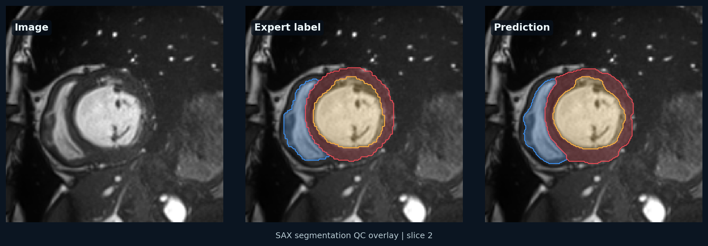
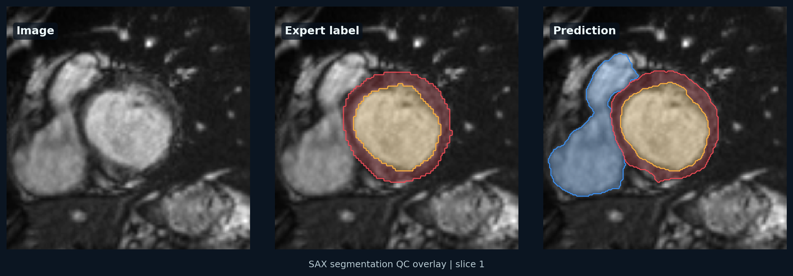

# ACDC Fold 0 Failure Analysis

This note reviews tail cases from the 300-epoch CPU debug nnU-Net run on ACDC fold 0 validation. The goal is to identify reproducible improvement targets, not to manually polish individual screenshots.

## Summary

The selected postprocessing strategy improved mean Dice from `0.8732` to `0.8740`. This is a real but small gain, indicating that the current bottleneck is model localization and cardiac anatomy consistency rather than isolated segmentation fragments.

| Structure | Dice | HD95 |
|---|---:|---:|
| Right ventricle | 0.8579 | 7.44 |
| Myocardium | 0.8547 | 4.49 |
| Left ventricle | 0.9093 | 3.99 |
| Mean | 0.8740 | 5.31 |

## Lowest-Scoring Cases

| Case | Mean Dice | Main issue |
|---|---:|---|
| `patient034_sax_es` | 0.6292 | Very small end-systolic LV cavity; LV and RV errors dominate |
| `patient094_sax_ed` | 0.7312 | Myocardial contour error |
| `patient081_sax_es` | 0.7791 | Multi-structure degradation in end systole |
| `patient091_sax_es` | 0.7807 | Myocardial and RV degradation in end systole |
| `patient050_sax_es` | 0.7971 | RV boundary/shape mismatch |
| `patient104_sax_es` | 0.8124 | LV cavity error with high HD95 |
| `patient006_sax_es` | 0.8138 | RV error and high HD95 |
| `patient029_sax_es` | 0.8251 | LV error and high HD95 |

## Representative Tail Examples

### `patient034_sax_es`

This is the most important failure case. The LV cavity is very small at end systole, so a small absolute boundary error causes a large Dice drop. This is not a cosmetic problem; it is a small-structure localization problem.

### `patient050_sax_es`

The RV has shape and boundary mismatch. RV segmentation is more sensitive to trabeculation, crescent geometry, and basal slice selection than LV blood pool segmentation.

### `patient135_sax_es`

This case illustrates slice-existence error: some basal/apical slices should not contain a structure, but the model still predicts it. Light area filtering helps only marginally; aggressive filtering removes valid thin slices and worsens mean performance.

## What The Postprocessing Grid Showed

| Variant | Mean Dice | Mean HD95 | Interpretation |
|---|---:|---:|---|
| 3D largest connected component only | 0.8732 | 5.32 | Good conservative baseline |
| Per-slice largest component, no area filter | 0.8740 | 5.30 | Best HD95, same rounded Dice as selected setting |
| Per-slice largest component, 2% area filter | 0.8740 | 5.31 | Selected because it lightly reduces tiny slice artifacts |
| Per-slice largest component, 10% area filter | 0.8729 | 5.53 | Starts to over-prune valid anatomy |
| Per-slice largest component, 20% area filter | 0.8689 | 6.20 | Too aggressive for basal/apical slices |

## Improvement Priorities

1. Run standard nnU-Net 2D training on CUDA with the official training schedule.
2. Add 3D full-resolution training and compare against the 2D baseline.
3. Evaluate all folds or use the official ACDC split consistently, reporting Dice and HD95 by structure.
4. Add failure-stratified reporting: ED vs ES, RV vs LV vs myocardium, and worst-case tail metrics.
5. Consider temporal or slice-continuity constraints only after establishing the full GPU nnU-Net baseline.

## Reviewer-Facing Interpretation

The current CPU debug result demonstrates a reproducible public cardiac MRI segmentation pipeline with held-out validation, quantitative metrics, postprocessing ablation, and failure analysis. It should not be described as a state-of-the-art or clinical model. The publishable claim is workflow reproducibility and transparent quality control; the next model-performance claim requires standard GPU training and broader validation.
