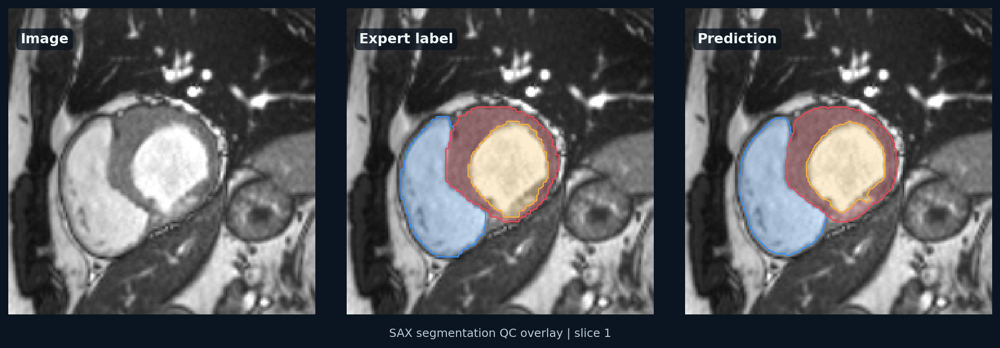
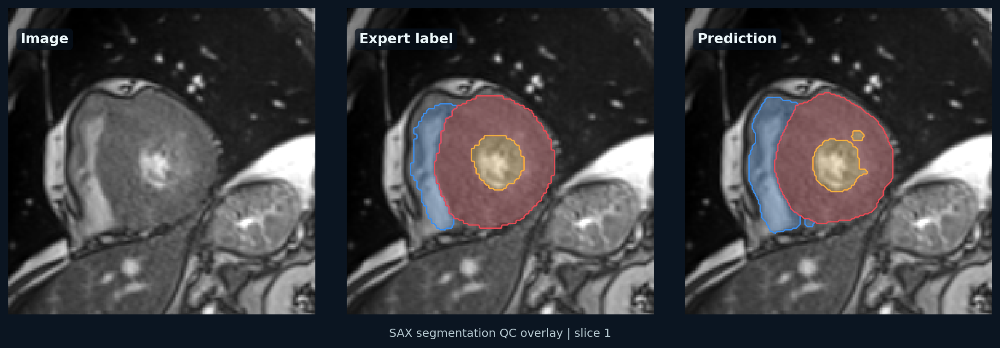

# ACDC nnU-Net Baseline

Status: ACDC downloaded, converted, verified, preprocessed, trained with a 300-epoch CPU debug trainer, postprocessed, and evaluated on the full fold 0 validation split. Full GPU baseline training not run yet.

## Experiment

- Dataset: ACDC cardiac MRI
- Model: nnU-Net v2
- Configuration: 2D baseline first, then 3D full resolution
- Fold: 0

## Metrics

| Structure | Dice | HD95 |
|---|---:|---:|
| Right ventricle | 0.8579 | 7.44 |
| Myocardium | 0.8547 | 4.49 |
| Left ventricle | 0.9093 | 3.99 |
| Mean | 0.8740 | 5.31 |

These are CPU debug metrics from a deliberately shortened trainer with 20 training iterations per epoch, 6 validation iterations per epoch, and conservative anatomical postprocessing. They validate the pipeline, but they are not a full nnU-Net benchmark result.

## Notes

Local environment verification:

- `nnunetv2==2.7.0` installed in `.venv`.
- Tiny synthetic NIfTI dataset was generated as `Dataset901_TinyCMR`.
- `nnUNetv2_plan_and_preprocess -d 901 -c 2d -npfp 1 -np 1 --verify_dataset_integrity --clean` completed successfully.
- CPU training with `nnUNetTrainer_tiny_debug` completed successfully after running outside the restricted sandbox.
- Tiny smoke-test mean validation Dice was `0.006632277081798084`, expectedly low because it only ran two training iterations.

Record GPU, CUDA, PyTorch, nnU-Net version, training time, and common errors here after running a full baseline on a GPU machine.

## Local ACDC Debug Runs

- Dataset source: public ACDC mirror downloaded to the external Xuhan volume
- Converted nnU-Net dataset: `Dataset001_ACDC`
- Training frames: 300 SAX ED/ES frames
- Labels:
  - 1: right ventricle
  - 2: myocardium
  - 3: left ventricle
- nnU-Net split: 240 training cases, 60 validation cases for fold 0
- Configuration: 2D
- Trainer: `nnUNetTrainer_tiny_debug`
- Device: CPU
- Epochs: 1
- Training iterations per epoch: 1
- Validation iterations per epoch: 1

Tiny debug output:

- `train_loss`: 2.1504
- `val_loss`: 2.0800
- Pseudo Dice by label: 0.0475, 0.0373, 0.1030
- Mean pseudo Dice: 0.0626
- Epoch time: 0.58 s

CPU debug 5-epoch run:

- Trainer: `nnUNetTrainer_cpu_debug_5epochs`
- Device: CPU
- Epochs: 5
- Training iterations per epoch: 5
- Validation iterations per epoch: 2
- Final `train_loss`: 0.4120
- Final `val_loss`: 0.3285
- Final pseudo Dice by label: 0.1098, 0.0033, 0.2345
- Best EMA pseudo Dice: 0.1425
- Final epoch time: 2.22 s

CPU debug 25-epoch run:

- Trainer: `nnUNetTrainer_cpu_debug_25epochs`
- Device: CPU
- Epochs: 25
- Training iterations per epoch: 10
- Validation iterations per epoch: 3
- Final `train_loss`: -0.3114
- Final `val_loss`: -0.2755
- Final pseudo Dice by label: 0.2492, 0.7142, 0.7063
- Best EMA pseudo Dice: 0.4118
- Final epoch time: 3.66 s

CPU debug 100-epoch run:

- Trainer: `nnUNetTrainer_cpu_debug_100epochs`
- Device: CPU
- Epochs: 100
- Training iterations per epoch: 10
- Validation iterations per epoch: 3
- Final `train_loss`: -0.6041
- Final `val_loss`: -0.5966
- Final pseudo Dice by label: 0.8405, 0.7414, 0.8512
- Best EMA pseudo Dice: 0.7721
- Final epoch time: 3.38 s

CPU debug 300-epoch run:

- Trainer: `nnUNetTrainer_cpu_debug_300epochs`
- Device: CPU
- Epochs: 300
- Training iterations per epoch: 20
- Validation iterations per epoch: 6
- Final `train_loss`: -0.8226
- Final `val_loss`: -0.7673
- Final pseudo Dice by label: 0.8911, 0.8548, 0.9109
- Best EMA pseudo Dice: 0.8972
- Final epoch time: 9.10 s

Fold 0 validation inference:

- Checkpoint: `checkpoint_best.pth`
- Validation cases: 60
- Raw prediction output: local `/private/tmp/cmr_acdc_val_fold0_pred_300epochs`
- Postprocessed prediction output: local `/private/tmp/cmr_acdc_val_fold0_pred_300epochs_pp_slice_lcc`
- Raw metrics: [`acdc_300epoch_fold0_val_metrics.md`](acdc_300epoch_fold0_val_metrics.md)
- Postprocessed metrics: [`acdc_300epoch_fold0_val_metrics_postprocessed.md`](acdc_300epoch_fold0_val_metrics_postprocessed.md)
- Representative validation QC: `patient116_sax_ed`

Postprocessing:

- Script: [`postprocess_segmentation.py`](../scripts/postprocess_segmentation.py)
- Selected rule: keep the largest 3D connected component per structure, keep only the largest component on each SAX slice, drop slices below 2% of the case-level peak label area, and drop tiny components below 64 voxels.
- Rationale: reduces anatomically implausible remote fragments without altering the learned cardiac contours manually.

Postprocessing grid:

| Variant | Mean Dice | Mean HD95 | Note |
|---|---:|---:|---|
| 3D LCC only | 0.8732 | 5.32 | Previous conservative cleanup |
| 3D LCC + per-slice LCC | 0.8740 | 5.30 | Similar Dice; slightly lower HD95 |
| 3D LCC + per-slice LCC + 2% area filter | 0.8740 | 5.31 | Selected for slightly better tail cleanup |
| Area filter >= 10% | 0.8729 | 5.53 | Over-prunes basal/apical slices |

Interpretation: the grid suggests that most remaining error is not small remote fragments. The hard cases involve small end-systolic cavities, RV shape ambiguity, and basal/apical slice-existence mistakes, so the next meaningful improvement should come from full GPU training and better spatial/temporal context rather than increasingly aggressive postprocessing.

Generated local artifacts:

```text
nnunet_workspace/raw/Dataset001_ACDC
nnunet_workspace/preprocessed/Dataset001_ACDC
nnunet_workspace/results/Dataset001_ACDC/nnUNetTrainer_tiny_debug__nnUNetPlans__2d/fold_0/checkpoint_best.pth
nnunet_workspace/results/Dataset001_ACDC/nnUNetTrainer_tiny_debug__nnUNetPlans__2d/fold_0/checkpoint_final.pth
nnunet_workspace/results/Dataset001_ACDC/nnUNetTrainer_tiny_debug__nnUNetPlans__2d/fold_0/progress.png
nnunet_workspace/results/Dataset001_ACDC/nnUNetTrainer_cpu_debug_5epochs__nnUNetPlans__2d/fold_0/checkpoint_best.pth
nnunet_workspace/results/Dataset001_ACDC/nnUNetTrainer_cpu_debug_5epochs__nnUNetPlans__2d/fold_0/checkpoint_final.pth
nnunet_workspace/results/Dataset001_ACDC/nnUNetTrainer_cpu_debug_5epochs__nnUNetPlans__2d/fold_0/progress.png
nnunet_workspace/results/Dataset001_ACDC/nnUNetTrainer_cpu_debug_25epochs__nnUNetPlans__2d/fold_0/checkpoint_best.pth
nnunet_workspace/results/Dataset001_ACDC/nnUNetTrainer_cpu_debug_25epochs__nnUNetPlans__2d/fold_0/checkpoint_final.pth
nnunet_workspace/results/Dataset001_ACDC/nnUNetTrainer_cpu_debug_25epochs__nnUNetPlans__2d/fold_0/progress.png
nnunet_workspace/results/Dataset001_ACDC/nnUNetTrainer_cpu_debug_100epochs__nnUNetPlans__2d/fold_0/checkpoint_best.pth
nnunet_workspace/results/Dataset001_ACDC/nnUNetTrainer_cpu_debug_100epochs__nnUNetPlans__2d/fold_0/checkpoint_final.pth
nnunet_workspace/results/Dataset001_ACDC/nnUNetTrainer_cpu_debug_100epochs__nnUNetPlans__2d/fold_0/progress.png
nnunet_workspace/results/Dataset001_ACDC/nnUNetTrainer_cpu_debug_300epochs__nnUNetPlans__2d/fold_0/checkpoint_best.pth
nnunet_workspace/results/Dataset001_ACDC/nnUNetTrainer_cpu_debug_300epochs__nnUNetPlans__2d/fold_0/checkpoint_final.pth
nnunet_workspace/results/Dataset001_ACDC/nnUNetTrainer_cpu_debug_300epochs__nnUNetPlans__2d/fold_0/progress.png
```

Representative public benchmark label QC:


Representative fold 0 validation prediction QC:



Representative failure analysis:



See [`acdc_failure_analysis.md`](acdc_failure_analysis.md) for tail cases and reviewer-facing interpretation.

Interpretation: the ACDC pipeline is now operational and can produce real held-out validation predictions with substantially cleaner SAX contours than the earlier CPU debug run. The current CPU debug result is acceptable for demonstrating reproducibility, but the next publishable milestone is a full 2D or 3D nnU-Net training run on a CUDA GPU with standard training length, fold aggregation, and held-out Dice/HD95.

## Available Scripts

```bash
python scripts/prepare_acdc.py \
  --source /path/to/acdc_raw \
  --output "$nnUNet_raw/Dataset001_ACDC"

python scripts/evaluate_segmentation.py \
  --pred-dir predictions/acdc_nnunet_2d_fold0 \
  --label-dir "$nnUNet_raw/Dataset001_ACDC/labelsTr" \
  --out-csv results/acdc_metrics.csv \
  --out-md results/acdc_metrics.md

python scripts/visualize_segmentation.py \
  --image "$nnUNet_raw/Dataset001_ACDC/imagesTr/patient001_frame01_0000.nii.gz" \
  --label "$nnUNet_raw/Dataset001_ACDC/labelsTr/patient001_frame01.nii.gz" \
  --prediction predictions/acdc_nnunet_2d_fold0/patient001_frame01.nii.gz \
  --output results/figures/acdc_patient001_frame01_overlay.png
```

The next publishable milestone is to train on ACDC and replace this placeholder table with held-out Dice and HD95 by structure.
