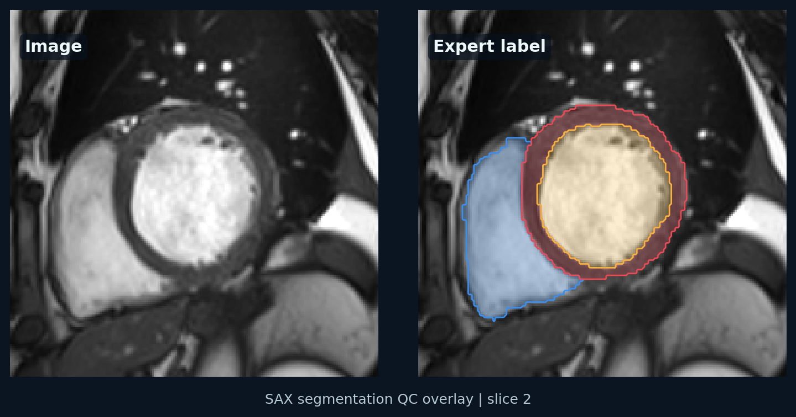

# ACDC nnU-Net Baseline

Status: ACDC downloaded, converted, verified, preprocessed, and 5-epoch CPU debug training completed. Full GPU baseline training not run yet.

## Experiment

- Dataset: ACDC cardiac MRI
- Model: nnU-Net v2
- Configuration: 2D baseline first, then 3D full resolution
- Fold: 0

## Metrics

| Structure | Dice | HD95 |
|---|---:|---:|
| Right ventricle | TBD | TBD |
| Myocardium | TBD | TBD |
| Left ventricle | TBD | TBD |
| Mean | TBD | TBD |

Tiny CPU debug training is not a performance estimate.

## Notes

Local environment verification:

- `nnunetv2==2.7.0` installed in `.venv`.
- Tiny synthetic NIfTI dataset was generated as `Dataset901_TinyCMR`.
- `nnUNetv2_plan_and_preprocess -d 901 -c 2d -npfp 1 -np 1 --verify_dataset_integrity --clean` completed successfully.
- CPU training with `nnUNetTrainer_tiny_debug` completed successfully after running outside the restricted sandbox.
- Tiny smoke-test mean validation Dice was `0.006632277081798084`, expectedly low because it only ran two training iterations.

Record GPU, CUDA, PyTorch, nnU-Net version, training time, and common errors here after running a full baseline on a GPU machine.

## Local ACDC Debug Runs

- Dataset source: public ACDC mirror downloaded to the external Xuhan volume
- Converted nnU-Net dataset: `Dataset001_ACDC`
- Training frames: 300 SAX ED/ES frames
- Labels:
  - 1: right ventricle
  - 2: myocardium
  - 3: left ventricle
- nnU-Net split: 240 training cases, 60 validation cases for fold 0
- Configuration: 2D
- Trainer: `nnUNetTrainer_tiny_debug`
- Device: CPU
- Epochs: 1
- Training iterations per epoch: 1
- Validation iterations per epoch: 1

Tiny debug output:

- `train_loss`: 2.1504
- `val_loss`: 2.0800
- Pseudo Dice by label: 0.0475, 0.0373, 0.1030
- Mean pseudo Dice: 0.0626
- Epoch time: 0.58 s

CPU debug 5-epoch run:

- Trainer: `nnUNetTrainer_cpu_debug_5epochs`
- Device: CPU
- Epochs: 5
- Training iterations per epoch: 5
- Validation iterations per epoch: 2
- Final `train_loss`: 0.4120
- Final `val_loss`: 0.3285
- Final pseudo Dice by label: 0.1098, 0.0033, 0.2345
- Best EMA pseudo Dice: 0.1425
- Final epoch time: 2.22 s

Generated local artifacts:

```text
nnunet_workspace/raw/Dataset001_ACDC
nnunet_workspace/preprocessed/Dataset001_ACDC
nnunet_workspace/results/Dataset001_ACDC/nnUNetTrainer_tiny_debug__nnUNetPlans__2d/fold_0/checkpoint_best.pth
nnunet_workspace/results/Dataset001_ACDC/nnUNetTrainer_tiny_debug__nnUNetPlans__2d/fold_0/checkpoint_final.pth
nnunet_workspace/results/Dataset001_ACDC/nnUNetTrainer_tiny_debug__nnUNetPlans__2d/fold_0/progress.png
nnunet_workspace/results/Dataset001_ACDC/nnUNetTrainer_cpu_debug_5epochs__nnUNetPlans__2d/fold_0/checkpoint_best.pth
nnunet_workspace/results/Dataset001_ACDC/nnUNetTrainer_cpu_debug_5epochs__nnUNetPlans__2d/fold_0/checkpoint_final.pth
nnunet_workspace/results/Dataset001_ACDC/nnUNetTrainer_cpu_debug_5epochs__nnUNetPlans__2d/fold_0/progress.png
```

Representative public benchmark label QC:



Interpretation: the ACDC pipeline is now operational, but the debug trainer intentionally runs too briefly to produce a meaningful segmentation model. The next publishable milestone is a full 2D or 3D nnU-Net training run with held-out Dice and HD95.

## Available Scripts

```bash
python scripts/prepare_acdc.py \
  --source /path/to/acdc_raw \
  --output "$nnUNet_raw/Dataset001_ACDC"

python scripts/evaluate_segmentation.py \
  --pred-dir predictions/acdc_nnunet_2d_fold0 \
  --label-dir "$nnUNet_raw/Dataset001_ACDC/labelsTr" \
  --out-csv results/acdc_metrics.csv \
  --out-md results/acdc_metrics.md

python scripts/visualize_segmentation.py \
  --image "$nnUNet_raw/Dataset001_ACDC/imagesTr/patient001_frame01_0000.nii.gz" \
  --label "$nnUNet_raw/Dataset001_ACDC/labelsTr/patient001_frame01.nii.gz" \
  --prediction predictions/acdc_nnunet_2d_fold0/patient001_frame01.nii.gz \
  --output results/figures/acdc_patient001_frame01_overlay.png
```

The next publishable milestone is to train on ACDC and replace this placeholder table with held-out Dice and HD95 by structure.
